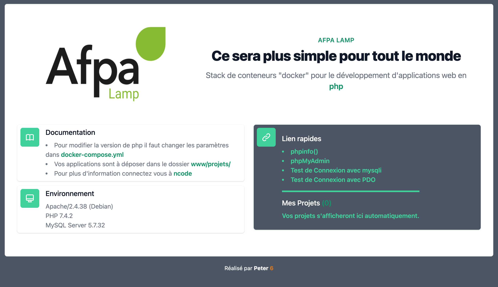

# Stack LAMP fait avec Docker Compose pour uniformiser les travaux des stagiaires





## Installation

* Vous devez déjà avoir [Docker](https://www.docker.com/products/docker-desktop) installé sur votre poste.
* Téléchargez ou clonez ce dépot.
* Lancez le Stack en ouvrant une invite de commande dans le dossier et tapez:

```zsh
docker-compose up -d
```

## Utilisation

* Une fois le Stack lancé, il vous suffit d'aller ouvrir dans votre navigateur la page `localhost:81`. Le port 81 est modifiable dans le fichier `.env`. Ce choix permet de faire tourner ce stack sur les machines sans se préoccuper de savoir si votre port 80 est déjà pris.
* Vous pouvez désormais créer vos projets dans le dossier `www/projets`en ajoutant un dossier par projet.
* Mysql est sur le port 3307 et on peut s'y connecter avec les identifiants suivant: `login = root | password = tiger`.
* Pour une connection PDO, la connection se fait comme dans le fichier d'exemple. Vous passez par l'intérieur du Stack et le host est `mysql:host=database:3306`.

## Adaptation du stack

* Vous pouvez changer la majorité des paramètres de ce stack dans le fichier .env et docker-compose.yml . Cependant je vous invite à consulter votre formateur avant toutes modifications.
* Ce projet est lui même une adaptation du Stack [docker-compose-lamp](https://github.com/sprintcube/docker-compose-lamp).
